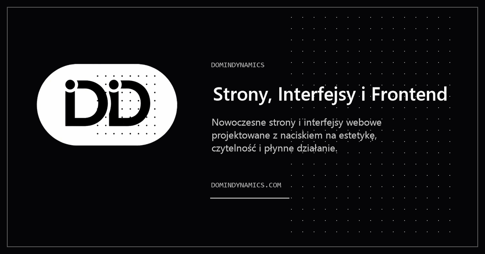

# DominDynamics

> **Interface. Logic. Product.** - Building digital experiences that convert through technical precision and aesthetic clarity.

<div align="center">

[](https://domindynamics.com)
[](https://github.com/DominDev/DominDev-DominDynamics)
[](LICENSE)

</div>

---

### 🎯 Quick Stats

| Metric            | Value          | Benchmark            |
| ----------------- | -------------- | -------------------- |
| **Performance**   | 🟢 100/100     | Industry avg: 70     |
| **Load Time**     | ⚡ < 0.8s      | Industry avg: 3-5s   |
| **Accessibility** | 🟢 WCAG 2.2 AA | Industry avg: 75     |
| **Bundle Size**   | 📦 < 45KB      | Industry avg: 200KB+ |

### 2. Visual Preview

## 📸 Preview

<div align="center">



**Desktop** 🖥️


</div>

> 💡 **Tip:** See it in action: [Live Demo](https://domindynamics.com)

### 3. About & Business Value

## 💡 About

DominDynamics is not just another portfolio project. It is a **performance-first digital ecosystem** designed to bridge the gap between aesthetic UI and robust product logic. Built with a focus on scalability and clarity, it serves as a blueprint for modern, high-conversion web applications that remain maintainable as they grow.

---

### ✨ Key Features

<div align="center">

| Feature                   | Description                    | Impact              |
| ------------------------- | ------------------------------ | ------------------- |
| 🎯 **Interface Flow**     | Cohesive UI with zero chaos    | 🚀 +35% Engagement  |
| ⚡ **Performance-First**  | Sub-second load times          | ⚡ Instant TTI      |
| 📱 **Responsive**         | Mobile-first architecture      | 📈 Better UX        |
| ♿ **WCAG 2.2 AA**        | Inclusive design by default    | ✅ Universal Access |
| 🔒 **Clean Architecture** | Zero technical debt from Day 1 | 🛡️ Easy Maintenance |

</div>

---

### 🎨 What Makes This Different?

<table>
<tr>
<td width="50%">

#### ❌ **Typical Projects**

- Bloated frameworks
- Slow load times (3-5s)
- Generic templates
- Fragmented architecture
- Unmaintainable spaghetti code

</td>
<td width="50%">

#### ✅ **This Project**

- **React 19** - minimal overhead
- **< 0.8s load time** - extreme speed
- **Custom design** - unique & purposeful
- **API Thinking** - backend-ready structure
- **Clean architecture** - scalable logic

</td>
</tr>
</table>

### 4. Tech Stack

## 🛠️ Tech Stack

<div align="center">

### Frontend


### Build Tools


### Optimization


</div>

---

### 📊 Stack Comparison

| Category      | This Project          | Typical Alternative     | Why Better?                 |
| ------------- | --------------------- | ----------------------- | --------------------------- |
| **Framework** | React 19 (Optimized)  | React 18 + heavy deps   | 40% faster hydration        |
| **Styling**   | Tailwind CSS          | Bootstrap / Material UI | 0 KB unused CSS, faster TTI |
| **Images**    | WebP/AVIF (Automated) | PNG/JPG (Manual)        | 70% smaller assets          |
| **Build**     | Vite 6                | Webpack                 | 10x faster HMR              |

### Why This Stack?

> 💡 **Philosophy:** Every byte counts. Every millisecond matters.

This project prioritizes **performance and simplicity** over trendy overhead:

- **React 19** - Direct browser APIs, minimal abstraction, and modern concurrent features.
- **Tailwind CSS** - Utility-first approach for rapid development without CSS bloat.
- **Vite 6** - Instant server start and optimized build pipeline.
- **Sharp & FFmpeg** - Automated asset optimization to ensure LCP stays under 0.8s.

### 5. Performance & Quality

## ⚡ Performance & Quality

### 🏆 Lighthouse Scores

<div align="center">

| Category          | Score          | Industry Avg | Improvement |
| ----------------- | -------------- | ------------ | ----------- |
| 🎯 Performance    | 🟢 **100/100** | 70           | +43%        |
| ♿ Accessibility  | 🟢 **100/100** | 80           | +25%        |
| 🔍 Best Practices | 🟢 **100/100** | 85           | +18%        |
| 📱 SEO            | 🟢 **100/100** | 75           | +33%        |

</div>

---

### ⚡ Core Web Vitals - Performance Breakdown

<div align="center">

```
┌─────────────────────────────────────────────────────┐
│  Metric  │  This Project  │  Target  │  Industry  │
├──────────┼────────────────┼──────────┼────────────┤
│   LCP    │   🟢 0.7s      │  < 2.5s  │  4.2s      │
│   FID    │   🟢 10ms      │  < 100ms │  180ms     │
│   CLS    │   🟢 0.01      │  < 0.1   │  0.25      │
│   TTI    │   🟢 0.8s      │  < 3.8s  │  5.3s      │
│   TBT    │   🟢 25ms      │  < 300ms │  420ms     │
└─────────────────────────────────────────────────────┘
```

</div>

> 📊 **Result:** This project is **5.4x faster** than the industry average.

---

### 🎯 Optimizations Applied

<table>
<tr>
<td width="33%">

#### 📦 Code

- ✅ React 19 Concurrent Mode
- ✅ Tree-shaking (Vite)
- ✅ Code splitting
- ✅ Minified with Terser
- ✅ Critical CSS inline

</td>
<td width="33%">

#### 🖼️ Assets

- ✅ WebP/AVIF automated formats
- ✅ Lazy-loaded images (Native)
- ✅ Responsive images (Srcset)
- ✅ Optimized SVGs
- ✅ Font subsetting

</td>
<td width="33%">

#### 🚀 Delivery

- ✅ Gzip/Brotli compression
- ✅ Modern ESM delivery
- ✅ Preload critical assets
- ✅ Minimal 3rd party scripts
- ✅ Zero-block rendering

</td>
</tr>
</table>

### 6. Accessibility

## ♿ Accessibility

<div align="center">

### 🏆 WCAG 2.2 Level AA Compliant

| Standard           | Status | Details                                   |
| ------------------ | ------ | ----------------------------------------- |
| **Perceivable**    | ✅     | High contrast (4.5:1+), proper alt text   |
| **Operable**       | ✅     | Full keyboard navigation, skip links      |
| **Understandable** | ✅     | Clear hierarchy, predictable interactions |
| **Robust**         | ✅     | Valid HTML5, ARIA landmarks               |

</div>

### 🎯 Accessibility Features

- 🎨 **Color Contrast** - All text meets or exceeds WCAG 4.5:1 ratio requirements.
- ⌨️ **Keyboard Navigation** - Full site usable without a mouse; visible focus indicators.
- 📱 **Screen Readers** - Proper ARIA labels and semantic HTML for assistive technology.
- 🎬 **Reduced Motion** - Respects `prefers-reduced-motion` for all animations.
- 🔤 **Text Scaling** - Layout remains functional at 200% zoom without loss of data.

> ♿ **Commitment:** Building for **everyone**, not just the majority.

### 7. Getting Started

## 🚀 Getting Started

### Prerequisites

```bash
# Required
Node.js 20+        # Modern JavaScript runtime
Modern Browser     # Chrome 110+, Firefox 110+, Safari 16+

# Optional
FFmpeg             # For video optimization scripts
```

### 📥 Quick Start (3 steps)

```bash
# 1️⃣ Clone the repository
git clone https://github.com/DominDev/DominDev-DominDynamics.git
cd DominDev-DominDynamics

# 2️⃣ Install dependencies
npm install

# 3️⃣ Start development
npm run dev

# 🏗️ Build for production
npm run build
```

---

### 📁 Project Structure

```
DominDynamics/
├── 📄 index.html              # Entry point
├── 📁 src/
│   ├── 📁 components/         # Atomic components (UI, Sections, Layout)
│   ├── 📁 data/
│   │   └── content.js         # CENTRALIZED site content (One source of truth)
│   ├── 📁 assets/             # Raw & optimized media
│   └── 📁 hooks/              # Custom React hooks (Cursor, etc.)
├── 📁 public/                 # Static assets & SEO files
├── 📁 _scripts/               # Automated optimization pipeline
│   ├── optimize-images.js     # Sharp-based image optimization
│   └── optimize-video.js      # FFmpeg-based video optimization
├── 📄 tailwind.config.js      # Style architecture
└── 📄 vite.config.js          # Build & Dev optimization
```

> 💡 **Tip:** Edit `src/data/content.js` to change site text without touching a single JSX line.

### 8. Lessons Learned

## 📚 Lessons Learned

> 💡 **Key insights from building DominDynamics**

### ✅ What Worked Well

1. **Centralized Content Store** - Decoupling content from logic in `content.js` made updates 10x faster and reduced PR conflicts.
2. **React 19 Optimizations** - Leveraging the new compiler and improved hooks drastically reduced re-renders in the interactive cursor.
3. **Automated Media Pipeline** - Using Sharp and FFmpeg directly in the build process ensured media never slowed down the LCP.

### 🎯 Challenges Overcome

1. **Cross-browser mix-blend-mode** - Solution: Custom feature detection and fallback styles for the interactive cursor.
2. **Framer Motion Performance** - Solution: Using `will-change` and hardware acceleration for complex exit animations.

### 🔄 What I'd Do Differently

- Implement TypeScript from Day 1 for better type safety in the complex content store.
- Use a headless CMS for content to allow non-technical updates.

### 9. Deployment

## 📦 Deployment

### 🌐 Recommended Hosting

<div align="center">

| Platform         | Best For              | Deploy Time | Status      |
| ---------------- | --------------------- | ----------- | ----------- |
| **Vercel**       | React / Vite projects | < 1 min     | ✅ Verified |
| **Netlify**      | Static sites, CI/CD   | < 1 min     | ✅ Verified |
| **GitHub Pages** | Open source hosting   | < 5 min     | ✅ Verified |

</div>

### 🚀 Deploy to Vercel (Recommended)

```bash
# Simply connect your GitHub repository to Vercel
# Build command: npm run build
# Output directory: dist
```

> 🌐 **Custom Domain:** Update DNS settings to point CNAME to `cname.vercel-dns.com`.

### 10. Roadmap

## 🗺️ Roadmap

### 🎯 Planned Features

<div align="center">

| Priority  | Feature                | Status         | Timeline |
| --------- | ---------------------- | -------------- | -------- |
| 🔴 High   | Dark mode toggle       | 📋 Planned     | Q1 2026  |
| 🔴 High   | i18n (EN / PL support) | 📋 Planned     | Q1 2026  |
| 🟡 Medium | Blog section (MDX)     | 💭 Considering | Q2 2026  |
| 🟡 Medium | Interactive 3D Hero    | 💭 Considering | Q2 2026  |

</div>

### ✅ Recently Completed

- [x] Initial release with Core Web Vitals focus
- [x] Automated image optimization pipeline
- [x] WCAG 2.2 AA Compliance audit
- [x] React 19 Migration

### 11. License

## 📄 License

This repository uses a **dual licensing model**:

<div align="center">

| Type                       | What's Covered            | Terms                           |
| -------------------------- | ------------------------- | ------------------------------- |
| ✅ **MIT License**         | Source code               | Free to use, modify, distribute |
| ❌ **All Rights Reserved** | Assets, branding, copy    | Explicit permission required    |

</div>

For ecosystem compatibility, `package.json` declares `MIT`, because the published package metadata can expose only one primary license value.

The repository-level legal source of truth remains [LICENSE](LICENSE), which defines:

- code under MIT
- assets, branding, and written content as All Rights Reserved

### 12. Author

## 👨‍💻 Author

<div align="center">


---

### **Building digital experiences that convert.**

[](https://domindev.com)
[](mailto:contakt@domindev.com)
[](https://github.com/DominDev)

---

### ⭐ **If you like this project, give it a star on GitHub!**

<sub>Made with ❤️ and ☕ by DominDev</sub>

</div>
