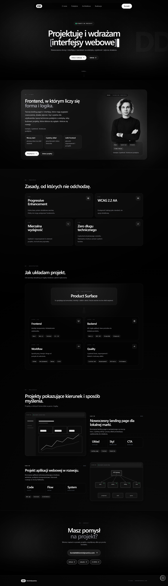

# DominDynamics

> **Interface. Logic. Product.**  
> Building digital experiences that feel premium, stay fast, and support real product growth.

<div align="center">

[](https://domindynamics.com)
[](https://github.com/DominDev/DominDev-DominDynamics)
[](LICENSE)

</div>

---

### Quick Stats

| Metric            | Value                        | Note                                      |
| ----------------- | ---------------------------- | ----------------------------------------- |
| **Performance**   | `99 desktop / 96 mobile`     | Based on real PageSpeed Insights reports  |
| **LCP**           | `0.5s desktop / 1.8s mobile` | Fast visual delivery on both form factors |
| **Accessibility** | `95 desktop / 100 mobile`    | Strong Lighthouse accessibility baseline  |
| **SEO**           | `100 / 100`                  | Technically ready for search visibility   |

### 2. Visual Preview

## Preview

<div align="center">


**Desktop**


</div>

> See it live: [domindynamics.com](https://domindynamics.com)

### 3. About & Business Value

## About

DominDynamics presents a clear point of view on modern product work: visual quality should not come at the cost of structure, speed, or clarity. The project is built to show how interface design, interaction logic, and technical discipline can work together in one cohesive digital experience.

This is not a generic template exercise. It is a focused demonstration of premium presentation, product-minded structure, and implementation quality meant to support real-world client work.

---

### Key Features

<div align="center">

| Feature                    | Description                                      | Value                        |
| -------------------------- | ------------------------------------------------ | ---------------------------- |
| **Interface Flow**         | Cohesive visual hierarchy with deliberate pacing | Stronger first impression    |
| **Measured Performance**   | Real PSI results on desktop and mobile           | Fast, credible experience    |
| **Responsive Design**      | Layout and motion adapted to smaller screens     | Better browsing comfort      |
| **Accessibility Baseline** | High Lighthouse accessibility scores             | Broader usability by default |
| **Product Structure**      | UI, logic, and content remain organized          | Easier iteration and scaling |

</div>

---

### What Makes This Different?

<table>
<tr>
<td width="50%">

#### Typical Projects

- generic visual language
- presentation-first, structure-second
- slow or uneven first load
- disconnected content and layout
- difficult to refine between iterations

</td>
<td width="50%">

#### This Project

- **custom visual identity**
- **measured speed, not only declared speed**
- **content and structure designed together**
- **fullstack-ready product thinking**
- **cleaner iteration path for future changes**

</td>
</tr>
</table>

### 4. Tech Stack

## Tech Stack

<div align="center">

### Frontend


### Build


### Asset Workflow


</div>

### Why This Stack?

This stack supports a practical goal: build experiences that are visually refined, technically controlled, and easy to evolve. React 19, Tailwind CSS, Vite 6, and a simple asset pipeline create a setup that favors speed, clarity, and iteration discipline over unnecessary overhead.

### 5. Performance & Quality

## Performance & Quality

### PageSpeed Snapshot

<div align="center">

| Category           | Desktop | Mobile |
| ------------------ | ------- | ------ |
| **Performance**    | `99`    | `96`   |
| **Accessibility**  | `95`    | `100`  |
| **Best Practices** | `100`   | `100`  |
| **SEO**            | `100`   | `100`  |

</div>

---

### Measured Metrics

<div align="center">

```text
┌──────────┬───────────────────┬───────────────────┐
│ Metric   │ Desktop           │ Mobile            │
├──────────┼───────────────────┼───────────────────┤
│ FCP      │ 0.3s              │ 1.6s              │
│ LCP      │ 0.5s              │ 1.8s              │
│ TBT      │ 90ms              │ 30ms              │
│ CLS      │ 0.017             │ 0.002             │
│ SI       │ 0.9s              │ 4.6s              │
└──────────┴───────────────────┴───────────────────┘
```

</div>

> Source: PageSpeed Insights reports from `2026-04-23` for `https://domindev.github.io/DominDev-DominDynamics/`.

### Applied Quality Layers

<table>
<tr>
<td width="33%">

#### Code

- React 19 application structure
- section-based composition
- centralized content layer
- Vite production build

</td>
<td width="33%">

#### Assets

- mirrored source-to-runtime asset pipeline
- optimized runtime media flow
- separated public and bundled assets
- image and video tooling support

</td>
<td width="33%">

#### Delivery

- static-first output
- modern ESM delivery
- minimal external dependency load
- strong Lighthouse technical baseline

</td>
</tr>
</table>

### 6. Accessibility

## Accessibility

The project aims to feel premium without excluding users. Accessibility is treated as part of quality, not as an afterthought.

### Accessibility Signals

- keyboard-focusable interactive controls
- semantic landmarks and structured content flow
- reduced-motion consideration for animated areas
- strong Lighthouse accessibility scores on both desktop and mobile

> Commitment: a polished interface should still remain usable, readable, and controllable.

### 7. Getting Started

## Getting Started

### Prerequisites

```bash
Node.js 20+
Modern browser
Optional: FFmpeg for media optimization scripts
```

### Quick Start

```bash
git clone https://github.com/DominDev/DominDev-DominDynamics.git
cd DominDev-DominDynamics
npm install
npm run dev
```

### Project Structure

```text
DominDynamics/
├── index.html              # Entry point and SEO shell
├── src/
│   ├── components/         # Sections, layout, effects, reusable UI
│   ├── data/
│   │   └── content.js      # Centralized content and section data
│   ├── assets/             # Runtime media used by the app
│   ├── hooks/              # Custom interaction hooks
│   ├── App.jsx             # Main page composition
│   ├── main.jsx            # App bootstrap
│   └── index.css           # Global Tailwind layer and base effects
├── public/                 # Static assets, icons, OG image, sitemap
├── README-assets/          # Repo-only preview images used in README
├── _archive/               # Archived, non-runtime asset variants
├── _assets-source/         # Git-ignored original media mirrored to repo paths
├── _scripts/               # Asset and snapshot tooling
│   ├── optimize-images.cjs # Sharp-based image optimization
│   └── optimize-video.cjs  # FFmpeg-based video optimization
├── tailwind.config.js      # Tailwind setup
└── vite.config.js          # Vite build configuration
```

### Content Edit

The project is structured to make fast iteration easier.

- headlines, CTA labels, section copy, work cards, and contact data live in `src/data/content.js`
- visual structure stays separated from business copy
- messaging can evolve without dismantling the layout

> Practical advantage: content can be refined quickly while preserving the visual system and component structure.

### 8. Lessons Learned

## Lessons Learned

### What Worked Well

1. Centralized content made iteration faster and cleaner.
2. Product thinking and visual direction could evolve without rewriting the whole structure.
3. The motion layer helped the site feel alive without losing control of hierarchy.

### Challenges Overcome

1. Balancing premium motion with readability and mobile stability.
2. Keeping expressive visuals aligned with technical performance goals.

### 9. Roadmap

## Roadmap

<div align="center">

| Priority | Feature                           | Status  |
| -------- | --------------------------------- | ------- |
| High     | Additional case study depth       | Planned |
| High     | Expanded content variants         | Planned |
| Medium   | Further asset optimization passes | Planned |
| Medium   | Additional showcase material      | Planned |

</div>

### 10. License

## License

This repository uses a dual licensing model:

<div align="center">

| Type                    | What's Covered         | Terms                           |
| ----------------------- | ---------------------- | ------------------------------- |
| **MIT License**         | Source code            | Free to use, modify, distribute |
| **All Rights Reserved** | Assets, branding, copy | Explicit permission required    |

</div>

For ecosystem compatibility, `package.json` declares `MIT`, because published package metadata can expose only one primary license value.

The repository-level legal source of truth remains [LICENSE](LICENSE), which defines:

- code under MIT
- assets, branding, and written content as All Rights Reserved

### 11. Author

## Author

**DominDev / DominDynamics**

Building digital experiences that convert through structure, clarity, and execution quality.

---

If the direction behind this project matches the kind of digital product you want to build, the live version is here:

**[View Live Demo](https://domindynamics.com)**
